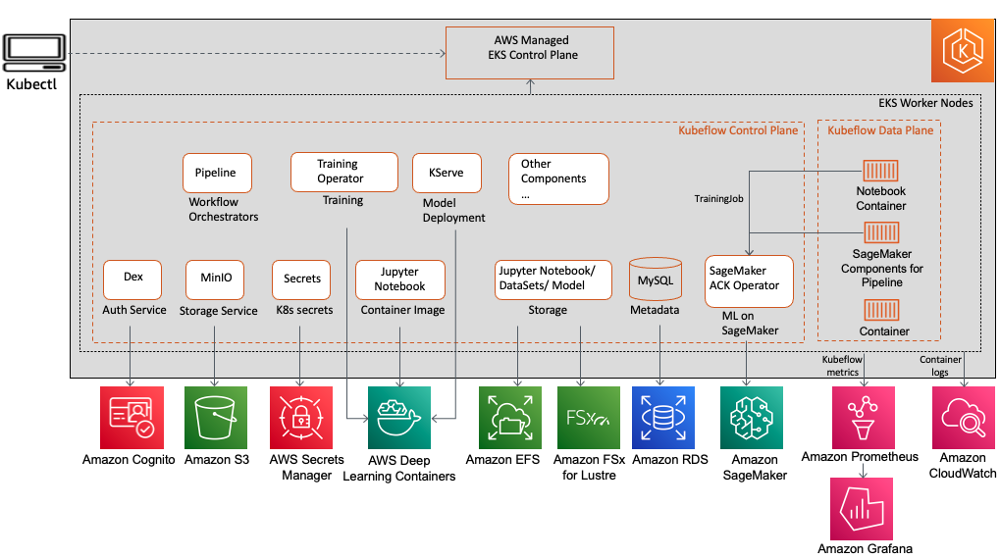
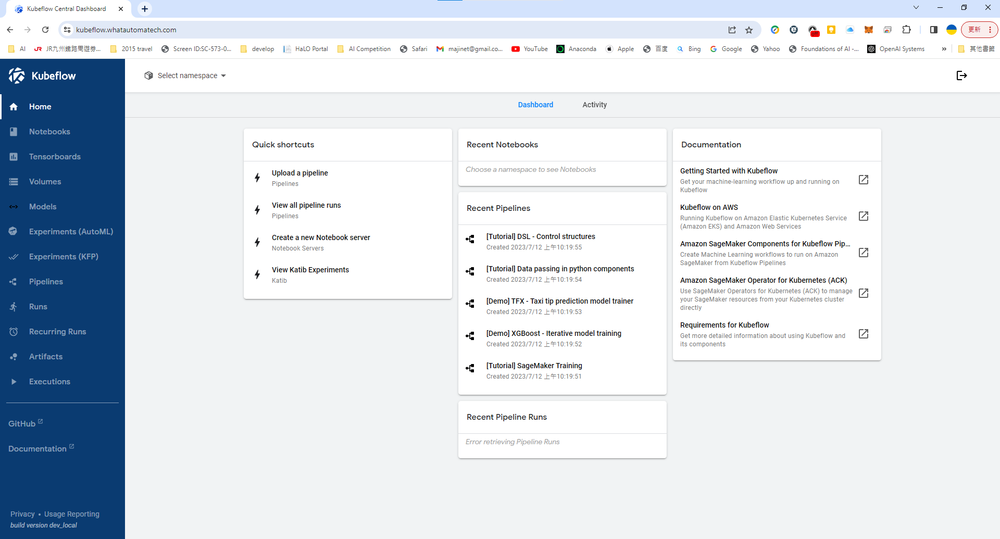

# Event-Driven MLOps Platform
This repository showcases an Distributed Event-Driven MLOps Platform that has been meticulously designed to facilitate the fine-tuning of pre-training models or building a new AI Models. It provides a highly scalable, fault-tolerant, and cost-effective solution, delivering exceptional performance, all specifically tailored to cater to the demands of AI/ML applications.

## Benefits

Event-driven architecture offers several benefits in the context of MLOps (Machine Learning Operations):

Scalability: Event-driven architectures allow for efficient scaling of MLOps systems. By decoupling components and leveraging asynchronous communication through events, it becomes easier to handle varying workloads and accommodate increased data processing demands.

Real-time responsiveness: Event-driven systems excel at handling real-time data and responding promptly to events. In MLOps, where timely decision-making is crucial, an event-driven architecture enables rapid processing of incoming data, facilitating quick model updates, predictions, and feedback loops.

Flexibility and extensibility: Event-driven architectures promote loose coupling and modular design. This flexibility allows for easy integration of new components, services, or event sources into the MLOps pipeline. It simplifies the addition of new machine learning models, data sources, or event triggers, enabling rapid experimentation and adaptation.

Fault tolerance and resilience: Event-driven systems can handle failures gracefully. If a component or service goes down, events can be buffered and processed later, ensuring fault tolerance and resiliency. This characteristic is essential in MLOps, where reliability is crucial for maintaining continuous model training, monitoring, and deployment processes.

Event-driven triggers for automation: Events can serve as triggers for automating various MLOps workflows. For example, training a new model can be triggered when new training data is received or when specific performance metrics cross defined thresholds. Event-driven architecture enables the automation of critical processes, reducing manual intervention and improving efficiency.

Event-driven data integration: MLOps often involves working with diverse data sources and systems. An event-driven architecture facilitates seamless integration of data from different sources and systems, enabling efficient data ingestion, transformation, and sharing across the MLOps pipeline.

## AWS Architectures
By leveraging AWS Cloud for our MLOps implementation, we gain several benefits. Firstly, we can take advantage of managed services provided by AWS, which alleviates the burden of infrastructure management. This enables us to focus more on developing applications rather than dealing with on-premise infrastructure or maintaining data centers.

Additionally, utilizing the cloud allows us to significantly reduce the time required for provisioning infrastructures. With AWS, we can rapidly set up and scale resources as needed, providing agility and flexibility for our MLOps workflows.

Furthermore, opting for the cloud eliminates the need for upfront investments in hardware and software. By leveraging AWS Cloud, we can avoid the initial costs associated with purchasing and maintaining physical infrastructure, resulting in cost savings and improved financial efficiency.

With the utilization of the Cloud, we can effortlessly implement agile and TDD (Test-Driven Development) methodologies, enabling us to achieve accelerated development processes.

### Core components:
- Virtual Private Cloud (VPC)
- AWS Elastic Kubernetes Service (EKS)
- AWS Elastic Container Registry (ECR)
- Kubeflow
- AWS SageMaker
- AWS Apache Kafka (MSK)
- S3 Bucket

### VPC Network diagrams

There are two options for building a VPC for EKS. One common approach is to create both public and private subnets.

The other option is to build a fully private VPC without facing internet. 

### Kubeflow on AWS EKS

Kubeflow is an open-source platform built on top of Kubernetes, designed to simplify the deployment and management of machine learning workflows and AI pipelines. It provides a set of tools, components, and best practices for running scalable and portable machine learning workloads on Kubernetes clusters.

Kubeflow allows data scientists and machine learning engineers to leverage Kubernetes' powerful orchestration capabilities for running distributed machine learning jobs, model training, and serving predictions. It integrates various open-source projects, such as TensorFlow, PyTorch, Jupyter, and Argo, to create an end-to-end platform for developing, deploying, and monitoring machine learning workflows.

Diagram reference from blog "Enabling hybrid ML workflows on Amazon EKS and Amazon SageMaker with one-click Kubeflow on AWS deployment"

Refer to Blog: [Enabling hybrid ML workflows on Amazon EKS and Amazon SageMaker with one-click Kubeflow on AWS deployment](https://aws.amazon.com/tw/blogs/machine-learning/enabling-hybrid-ml-workflows-on-amazon-eks-and-amazon-sagemaker-with-one-click-kubeflow-on-aws-deployment/).

### Kubeflow Homepage
Follow [Cognito Manual Deployment Guide](https://awslabs.github.io/kubeflow-manifests/docs/deployment/cognito/manifest/guide/) to install domain and AWS Application Load Balancer (ALB). After installation completed, kubeflow homepage can be logged in.

